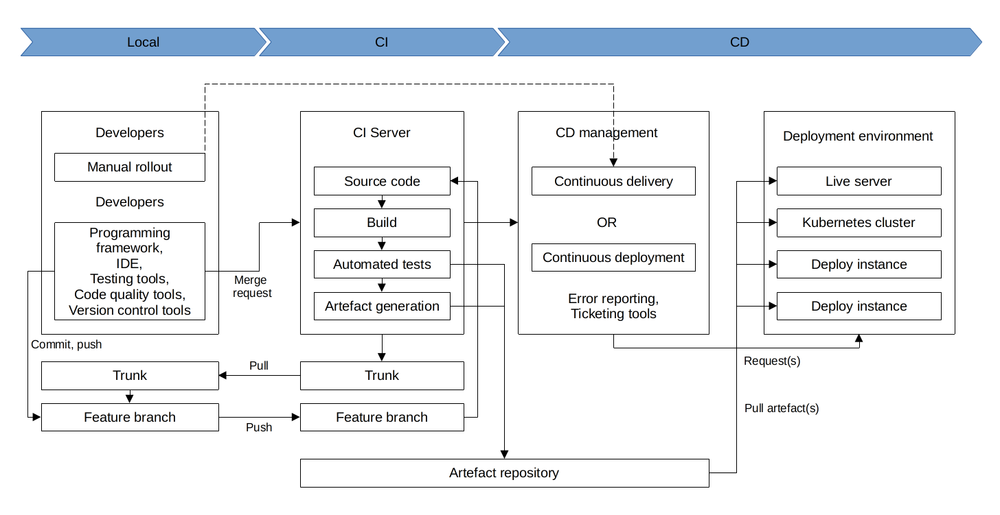

# Application code workflows

An overview of the background info, design, and implementation of a production-ready CI/CD pipeline for application 
code.

## Assumptions

Assuming trunk based development:

*   Small, frequent commits reduce the scope of each integration
*   Automated testing
*   Feature toggles

## Cloning and branching

The first step in making changes to a code base is to clone the repository locally and begin development on a new 
branch. Using git:

    git clone $REPO_URL
    git checkout -b $NEW_BRANCH_NAME

## Running code locally

To run the code locally to sanity check the current state of trunk (to be clean and unbroken), spin up a local 
environment for the application code to test it out. For a simple web server written in a general purpose programming 
language, run the server code to bring up a local copy of the application and manually test it by loading the web 
server in the browser. Or, run the automated test suite associated with the application.

## Making code changes

Testing application code can be done in seconds (because everything is local).

## Pull (Merge) requests and reviews

Focus the review process on things that are hard to check through automated testing, such as checking security flaws, 
reviewing general code design, enforcing style guides, or identifying potential performance issues on larger data sets.

## Running automated tests
                                                                                                                        
Set up a CI server (such as Jenkins or CircleCI) giving a consistent build process on a repeatable and isolated 
platform, with commit hooks that automatically trigger testing of any branch submitted for review. Most developers will 
run a subset of the tests that relate to the feature branch being done, leading to faster feedback cycles. Include 
automated tests designed to verify that the change didn’t create any regressions while testing a new change.

The CI server is to run the full automated test suite for the application code, and report the results as a summary, 
using a simple green check mark to indicate success or a red "X" for failure.

## Merging and releasing

After merging the code into trunk, a new, immutable, versioned release artifact can be generated that can be deployed.

The release artifact will vary widely from project to project for application code. This could be anything from a 
source file tarball or a jar file executable to a docker image or a VM image. Make sure the artifact is immutable, and 
that it has a unique version number.

## Deploying

Once review and tests pass, the deployment part of the CI/CD pipeline begins. The code can be deployed to development, 
testing, or production systems.

Deploying the release artifact to the environment depends on how the code is packaged. If it is a library, then it will 
be deployed when the application that consumes it updates the library version. In this case, nothing needs to be done 
to deploy it to the application. For services, the application can be deployed to live servers. For docker images, this 
might mean updating service definitions for the docker cluster (ECS or Kubernetes). For machine images, this might mean 
updating the autoscaling group to deploy instances with the new image. 

There are various strategies for deploying application code, such as canary and blue-green deployments. 
